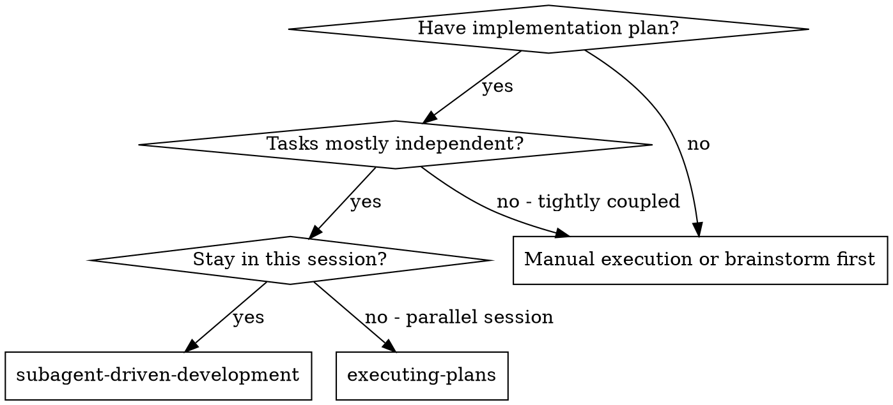
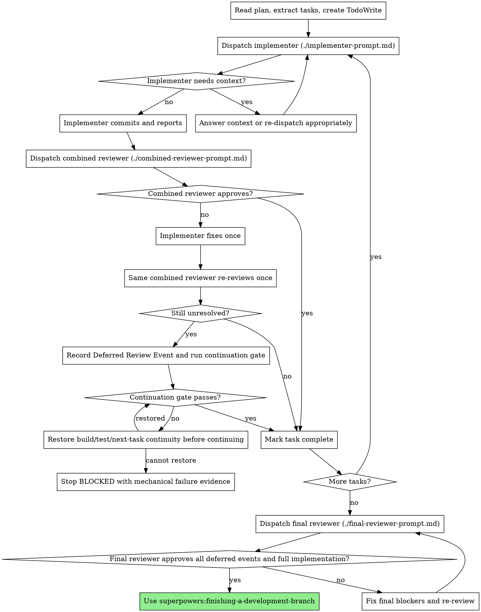

# Subagent-Driven Development

Execute an implementation plan with one fresh implementer per task and one combined reviewer per task. The reviewer must check spec compliance first, then code quality. This keeps the quality gates while reducing reviewer subagent churn.

**Why subagents:** Implementers get isolated context and focused instructions. The controller keeps coordination context, supplies exact task text, and prevents workers from reading broad plan history.

**Core principle:** Fresh implementer per task + one ordered combined review + final whole-branch review.

## When to Use



## Execution Preflight

Before dispatching any implementer:

1. Read the implementation plan once.
2. Extract every task with its full text and scene-setting context.
3. Create TodoWrite/update_plan items for all tasks.
4. If the plan has a Risk Coverage Index, verify every risk ID appears inside at least one task's text, not only in the index or linked risk contract.
5. For every task with `Risk Coverage`, verify it also includes risk-driven behavior, tests, observability where applicable, and verification commands.
6. If any risk lacks task-level coverage, stop and fix the plan before dispatching implementers.

The Risk Coverage Index is traceability only. Implementer and reviewer subagents receive task text, so every requirement they own must be embedded in that task.

## The Process



## Per-Task Review Rules

Use `./combined-reviewer-prompt.md` for the default per-task review.

The combined reviewer has two ordered phases:

1. **Spec compliance:** Did the implementation build exactly what the task requested, including risk-driven requirements? If this fails, the reviewer stops and does not perform code quality review.
2. **Code quality:** Only after spec compliance passes, check maintainability, architecture, testing, edge cases, and task-local production readiness.

If the combined reviewer reports `NEEDS_FIX`, send the findings to the same implementer and allow exactly one fix pass. Then ask the same combined reviewer to re-review exactly once. If that reviewer subagent is no longer available, dispatch one replacement combined reviewer with the original review, fix report, and current git range; this still counts as the single re-review.

If findings remain after the single re-review, do not keep looping and do not ask the human partner to judge code. Record a Deferred Review Event, run the continuation gate, then continue to the next task only if the branch can still proceed.

## Deferred Review Events

Deferred Review Events preserve unresolved per-task findings for final review.

Record every unresolved event in the controller notes. If there is any chance of context compaction or a long run, also write them to:

```bash
git rev-parse --git-path superpowers/deferred-review-events.md
```

Use this format:

```markdown
## DRE-001: [short title]

- Task: Task N - [name]
- Reviewer phase: Spec compliance | Code quality
- Original finding: [specific issue, with file:line if available]
- Fix attempted: [commit SHA or summary]
- Re-review result: [what remains unresolved]
- Severity claimed by reviewer: Critical | Important | Minor
- Continuation gate:
  - build: passed | failed | not run, with reason
  - targeted tests: passed | failed | not run, with reason
  - full tests: passed | failed | not run, with reason
  - downstream task impact: no blocker found | blocker restored | unknown, with reason
- Affected files: [paths]
- Final reviewer instruction: Re-check this event before approving. If still real and Critical/Important, require a fix before completion.
```

Deferred means "final reviewer must decide later," not "approved." Do not lose these events in chat history.

## Continuation Gate

After recording a Deferred Review Event, verify the branch can continue:

- Run the task's required verification commands if provided.
- Run the smallest project build/test command that proves the next task can start.
- Check that public interfaces or files needed by the next task still exist.

Unresolved review findings may be deferred. A broken build, failing required test, or missing next-task interface must be restored before continuing. Record the underlying review finding as deferred, but fix continuity enough to keep executing the plan.

If continuity cannot be restored after a focused repair attempt or a stronger-model retry, stop as `BLOCKED` with the exact failing command/output and current Deferred Review Events. This is not asking the human partner to judge code; it is reporting that execution cannot mechanically continue.

## Final Review

After all tasks are implemented, dispatch `./final-reviewer-prompt.md`.

The final reviewer must receive:

- The full implementation plan or a precise plan summary
- Base SHA before Task 1
- Final HEAD SHA
- Implementer summaries for all tasks if available
- Full Deferred Review Events text, or `None`
- Final verification command outputs

The final reviewer must classify every Deferred Review Event as:

- `Resolved`
- `Still blocker`
- `Accept as minor`
- `Reviewer was wrong`

Any `Still blocker` prevents completion. Fix final blockers, run verification, and re-dispatch the final reviewer. Only after final reviewer approval should the controller use `superpowers:finishing-a-development-branch`.

## Model Selection

Use the least powerful model that can handle each role:

- Mechanical implementation tasks: fast, cheap model
- Integration/debugging tasks: standard model
- Combined reviewer and final reviewer: most capable available model

## Handling Implementer Status

**DONE:** Proceed to combined review.

**DONE_WITH_CONCERNS:** Read concerns before review. If concerns affect correctness, scope, risk coverage, build/test status, or downstream continuity, address them before review. Otherwise include them in reviewer context.

**NEEDS_CONTEXT:** Provide missing context and re-dispatch.

**BLOCKED:** Change something before retrying: provide context, use a stronger model, split the task, or fix the plan. Never force the same retry without changes.

## Prompt Templates

- `./implementer-prompt.md` - Dispatch implementer subagent
- `./combined-reviewer-prompt.md` - Default per-task reviewer
- `./final-reviewer-prompt.md` - Whole-implementation final reviewer

## Example Workflow

```
Task 2: Recovery modes

[Dispatch implementer with full task text and context]
Implementer:
  - Added verify/repair modes
  - Tests passing
  - Committed abc123

[Dispatch combined reviewer]
Combined reviewer:
  Phase 1 Spec compliance: APPROVED
  Phase 2 Code quality: NEEDS_FIX
  Important: progress interval magic number in src/recovery.ts:44

[Same implementer fixes once]
Implementer:
  - Extracted PROGRESS_INTERVAL
  - Committed def456

[Same combined reviewer re-reviews once]
Combined reviewer:
  APPROVED

[Mark Task 2 complete]

Task 3: UI wiring
...
[Re-review still has an unresolved Minor finding]
[Record DRE-001, run continuation gate, continue]

[After all tasks]
[Dispatch final reviewer with DRE-001]
Final reviewer:
  DRE-001: Accept as minor
  Full implementation: approved

[Use finishing-a-development-branch]
```

## Red Flags

**Never:**

- Start implementation on main/master without explicit human consent.
- Dispatch separate spec and code quality reviewers in the default flow.
- Start code quality review before spec compliance passes.
- Run more than one automatic fix/re-review loop for a task.
- Drop unresolved findings without a Deferred Review Event.
- Ask a non-technical human partner to judge code correctness.
- Continue with broken build/tests or missing next-task interfaces.
- Let implementer self-review replace combined review.
- Dispatch multiple implementation subagents in parallel for the same worktree.
- Make subagents read the plan file; provide exact task text instead.
- Finish the branch before final reviewer classifies every Deferred Review Event.

**If a task has Risk Coverage:**

- Include the task's `Risk Coverage` and `Risk-Driven Requirements` in the implementer prompt.
- Include the same task text in the combined reviewer prompt.
- Treat missing risk-driven tests, observability, or verification as spec compliance failures.

## Integration

**Required workflow skills:**

- **superpowers:using-git-worktrees** - REQUIRED: Set up isolated workspace before starting
- **superpowers:writing-plans** - Creates the plan this skill executes
- **superpowers:finishing-a-development-branch** - Complete development after final reviewer approval

**Subagents should use:**

- **superpowers:test-driven-development** - Implementers follow TDD for each task

**Alternative workflow:**

- **superpowers:executing-plans** - Use for parallel session instead of same-session execution
